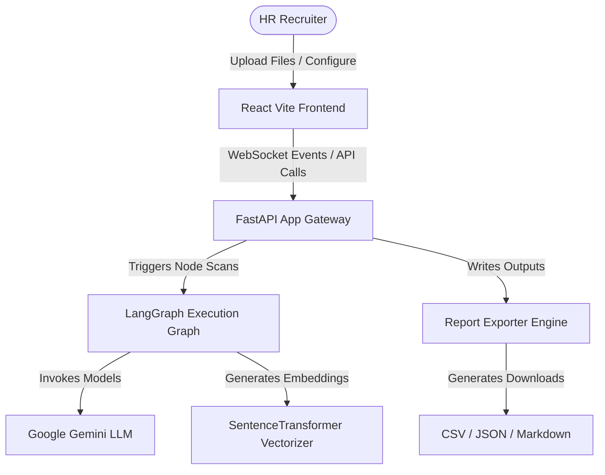
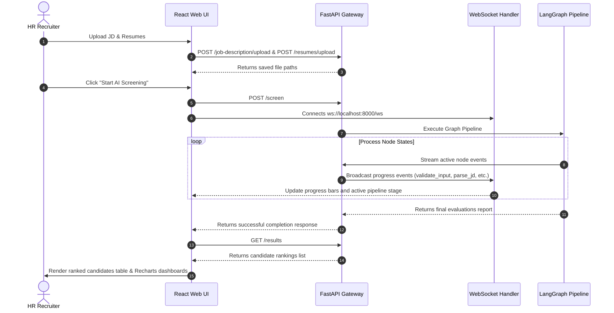

# HIreAI Resume Screening Agent

🤖 **An Enterprise-Grade AI-Powered Resume Screening & Parsing Agent utilizing LangGraph, FastAPI, and React.**

[](https://github.com/ankitverma969/HIreAI_Test/actions/workflows/ci.yml)
[](LICENSE)
[](https://www.python.org/downloads/release/python-3110/)
[](https://react.dev/)

---

## 1. Project Overview & Problem Statement

### The Problem
Recruiting teams at high-growth enterprises are inundated with thousands of applications for open roles. Manual resume screening is slow, highly prone to cognitive bias, and difficult to coordinate. Standard Applicant Tracking Systems (ATS) rely on simple keyword-matching, missing qualified candidates with non-standard keywords but matching experience.

### The Solution
**HIreAI Agent** is a professional AI screening copilot. It parses unstructured resume documents (PDF, DOCX, TXT) and target job descriptions into validated structured objects, processes semantic similarities, computes deterministic rule-based weighted scores, and uses LangGraph workflows to generate qualitative reasoning, structured hiring recommendations, and personalized interview questions.

---

## 2. Technology Stack

- **Backend**: Python 3.11, FastAPI, Uvicorn, Pydantic v2
- **NLP & Embeddings**: spaCy (`en_core_web_sm`), SentenceTransformers (`all-MiniLM-L6-v2`)
- **Agent Framework**: LangGraph, LangChain, Google Generative AI (Gemini 1.5)
- **Frontend**: React 19, Vite, Recharts, Axios, Context API, Vanilla CSS Modules
- **Quality & Static Analysis**: Ruff, Black, MyPy, Pre-commit
- **Testing**: pytest (Backend), Vitest + React Testing Library (Frontend)
- **Containerization**: Docker, Docker Compose

---

## 3. System Architecture & Diagrams

### System Architecture Overview
The system follows Clean Architecture, separation of concerns, and unidirectional data flow.



### LangGraph Workflow Pipeline
The agent's decision logic is orchestrated as a deterministic state graph:


### API Flow Sequence


---

## 4. Repository Directory Structure

```directory
HIreAI_Test/
├── .github/                   # GitHub templates and workflows
│   ├── ISSUE_TEMPLATE/
│   │   ├── bug_report.md
│   │   └── feature_request.md
│   ├── workflows/
│   │   └── ci.yml             # Github Actions CI pipeline
│   └── PULL_REQUEST_TEMPLATE.md
├── app/                       # Core python backend codebase
│   ├── api/                   # Router and controllers
│   ├── core/                  # Configurations, logging, and exceptions
│   ├── extractor/             # Rule-based NLP entity extractors
│   ├── graph/                 # LangGraph pipeline workflow definition
│   ├── llm/                   # LLM client wrappers
│   ├── models/                # Pydantic structured schemas
│   ├── parser/                # File text parsers (PDF, DOCX, TXT)
│   └── services/              # Core business services
├── data/                      # Ingestion uploads and outputs storage
│   ├── samples/               # Mock resumes and job description sample
│   └── uploads/
├── docs/                      # Screenshots and diagrams documentation
├── frontend/                  # React Vite workspace
│   ├── src/
│   │   ├── __tests__/         # Vitest component & hook tests
│   │   ├── components/        # Reusable UI widgets
│   │   ├── context/           # Global providers (Theme, Analysis, etc.)
│   │   ├── hooks/             # Custom utility hooks
│   │   ├── layout/            # Sidebar & Top nav templates
│   │   ├── pages/             # Route page containers
│   │   └── services/          # API network adapters
│   ├── Dockerfile
│   └── nginx.conf             # Production Nginx SPA proxy
├── tests/                     # Pytest backend test suite
├── Dockerfile                 # Backend deployment container
├── docker-compose.yml         # One-command startup config
├── pyproject.toml             # Ruff, Black, and MyPy configurations
└── requirements.txt           # Backend python dependencies list
```

---

## 5. Local Onboarding & Installation

### Prerequisites
- Python 3.11
- Node.js v20 (with npm)
- Gemini API Key (or OpenAI/Groq keys)

### Backend Setup
1. Clone the repository and navigate to root:
   ```bash
   git clone https://github.com/ankitverma969/HIreAI_Test.git
   cd HIreAI_Test
   ```
2. Build virtual environment and install packages:
   ```bash
   python -m venv venv
   .\venv\Scripts\activate
   pip install -r requirements.txt
   python -m spacy download en_core_web_sm
   ```
3. Establish environmental configurations:
   ```bash
   cp .env.example .env
   ```
   Add your keys to `.env` (e.g. `GEMINI_API_KEY=AIzaSy...`).

4. Launch the FastAPI server:
   ```bash
   python main.py
   ```
   Server launches at `http://localhost:8000`. OpenAPI endpoints docs at `http://localhost:8000/docs`.

### Frontend Setup
1. Open a new terminal inside the `frontend` folder:
   ```bash
   cd frontend
   npm install
   ```
2. Start the development server:
   ```bash
   npm run dev
   ```
   UI launches at `http://localhost:5173`.

---

## 6. Docker Deployment (One-Command Startup)

Launch both the backend server and React interface containerized:

```bash
docker compose up --build
```
- **React Frontend**: served at `http://localhost`
- **FastAPI Backend**: served at `http://localhost:8000`

---

## 7. API Reference Table

| Method | Endpoint | Description | Payload / Response |
| --- | --- | --- | --- |
| `POST` | `/job-description/upload` | Upload Job Description (PDF/DOCX/TXT) | `multipart/form-data` -> `SuccessResponse` |
| `POST` | `/resumes/upload` | Upload Candidate Resumes (PDF/DOCX/TXT) | `multipart/form-data` -> `SuccessResponse` |
| `POST` | `/screen` | Trigger the LangGraph screening pipeline | Returns report ID & parsed candidates count |
| `GET` | `/results` | Get the latest evaluation rankings | Returns rankings data array |
| `GET` | `/candidate/{candidate_id}` | Fetch detailed candidate profile & AI reviews | Returns structured bio and scores breakdown |
| `GET` | `/download/csv` | Download flat CSV report | Returns file attachment |
| `GET` | `/download/json` | Download structured JSON report | Returns file attachment |
| `GET` | `/download/report` | Download Markdown summary report | Returns file attachment |
| `WS` | `/ws` | WebSocket pipeline progress node socket | Streams node completion updates |

---

## 8. Sample Workflows & Decisions Results

Our workspace contains realistic sample resources located in [E:\Agent\data\samples\resumes](file:///E:/Agent/data/samples/resumes) to showcase the pipeline's capabilities:

- **Strong Hire**: `resume_1_strong_hire_senior.txt` (8+ years experience, expert match in Python, FastAPI, Docker, and React).
- **Hire**: `resume_2_hire_mid.txt` (4 years experience, strong in Python/FastAPI backend).
- **Consider**: `resume_4_consider_junior.txt` (1 year junior developer, matches fundamental Python).
- **Review**: `resume_6_review_qa.txt` (QA automation focused, requires code manual audits).
- **Reject**: `resume_8_reject_unrelated.txt` (Unrelated graphic design profile, missing technical stack).

---

## 9. Testing & Quality Standards

### Running Backend Tests
```bash
python -m pytest tests/
```
### Running Frontend Tests
```bash
cd frontend
npm run test
```

### Static Analysis Checks
```bash
ruff check .
black --check .
mypy app main.py
```

---

## 10. Screenshots & Walkthroughs

Please refer to the screenshots folder at `docs/screenshots/` for UI illustrations.

* **Upload Screen**: Drag-and-drop file ingestion zone.
* **Pipeline Progress Screen**: Real-time Node updates.
* **Rankings Board**: Glassmorphic, sortable candidate rankings dashboard.
* **Analytics Panel**: Charts demonstrating matching parameters.

---

## License & Contribution Guidelines
This project is licensed under the [MIT License](LICENSE). Contributions must follow the guidelines detailed in [CONTRIBUTING.md](CONTRIBUTING.md).
