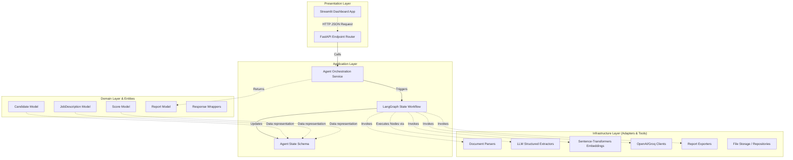

# AI Resume Screening Agent - Foundation & Architecture

Enterprise-grade, modular, and type-safe Clean Architecture codebase foundation for a Resume Screening AI Agent. Built following modern software engineering patterns using python 3.12+, FastAPI, Streamlit, LangGraph, and Pydantic v2.

---

## Project Overview

This repository establishes the foundational blueprint and interfaces for an automated candidate recruitment pipeline. The architecture defines layers separating core business entities, agent state traversal graph, service orchestration, document parsing pipelines, and presentation frontends.

---

## Architecture Diagram

The project is structured under **Clean Architecture** patterns, separating concerns across distinct concentric circles:



---

## Folder Structure

```
resume-screening-agent/
│
├── app/
│   ├── api/                      # Presentation: API routes, schemas, request dependencies
│   │   ├── dependencies.py
│   │   └── router.py
│   │
│   ├── core/                     # Infrastructure: Central configuration, logging, exceptions
│   │   ├── config.py
│   │   ├── constants.py
│   │   ├── exceptions.py
│   │   ├── logging.py
│   │   └── security.py
│   │
│   ├── graph/                    # Application: LangGraph State definition & graph workflow
│   │   ├── state.py
│   │   └── workflow.py
│   │
│   ├── models/                   # Domain: Pydantic v2 data entities and schemas
│   │   ├── candidate.py
│   │   ├── job_description.py
│   │   ├── report.py
│   │   ├── response.py
│   │   └── score.py
│   │
│   # --- Infrastructure Layer Interfaces & Boundaries ---
│   ├── parser/                   # Raw document readers (PDF, Docx, Txt)
│   ├── extractor/                # AI-driven profile metadata structure extractors
│   ├── scorer/                   # Similarity & score mathematical aggregators
│   ├── embeddings/               # Vector representation translators
│   ├── llm/                      # Upstream Large Language Model connector clients
│   ├── prompts/                  # Unified instruction template loaders
│   ├── exporters/                # Disk persistence wrappers (CSV, JSON)
│   ├── repositories/             # Access repository data abstraction boundary
│   ├── services/                 # Workflow service orchestrators
│   └── utils/                    # Shared validation helpers
│
├── streamlit_app/                # Presentation: Streamlit Dashboard UI Code
│   └── app.py
│
├── data/                         # Persistent input volumes (JDs, Resumes)
├── outputs/                      # Generated evaluation files (CSV, JSON, Reports)
├── tests/                        # Suite tests covering APIs, Parsers, Scorers, Graphs
├── docs/                         # Extended documentation
│
├── .env                          # Local environment settings credentials
├── .env.example                  # Environment configuration template
├── .gitignore                    # Standard development filter definitions
├── requirements.txt              # Application library versions descriptors
├── pyproject.toml                # Static tool analyzer configs (Ruff, Mypy, Black)
├── main.py                       # FastAPI application factory entrypoint
└── README.md                     # Documentation readme
```

---

## Technology Stack

- **Runtime**: Python 3.12+
- **API Framework**: FastAPI
- **Web Interface**: Streamlit
- **Agent Framework**: LangGraph
- **Vector Embeddings**: Sentence-Transformers
- **Upstream GenAI**: LangChain (OpenAI & Groq wrappers)
- **Data Structuring**: Pydantic v2
- **Testing & Verification**: Pytest, Ruff, Mypy, Black

---

## Installation

1. **Clone project directory and navigate to root**:
   ```bash
   cd resume-screening-agent
   ```

2. **Create and activate a python virtual environment**:
   ```bash
   python -m venv venv
   # Windows (Powershell):
   .\venv\Scripts\Activate.ps1
   # macOS/Linux:
   source venv/bin/activate
   ```

3. **Install application dependencies**:
   ```bash
   pip install -r requirements.txt
   ```

---

## Environment Variables

Copy the template file to set up environment credentials:
```bash
cp .env.example .env
```
Ensure you update the API tokens inside `.env` before running:
- `OPENAI_API_KEY`: Authentication key for OpenAI completion APIs.
- `GROQ_API_KEY`: Authentication key for Groq completion APIs.
- `LOG_LEVEL`: Output detail level (DEBUG, INFO, WARNING, ERROR).

---

## Running Backend API

To run the FastAPI server locally with auto-reload:
```bash
uvicorn main:app --reload
```
Once started:
- Access interactive documentation (Swagger UI) at: [http://127.0.0.1:8000/docs](http://127.0.0.1:8000/docs)
- Verify system version at: [http://127.0.0.1:8000/version](http://127.0.0.1:8000/version)

---

## Running Frontend UI

To run the Streamlit dashboard locally:
```bash
streamlit run streamlit_app/app.py
```
This opens the frontend client interface at [http://localhost:8501](http://localhost:8501).

---

## Future Roadmap

- Integrate LLM adapters for parsing structured data from unstructured formats.
- Wire up local/cloud embedding vectors and similarity distance computation node.
- Standardize PDF/Docx loading interfaces using `pdfplumber` and `pymupdf`.
- Develop detailed unit & integration test suites validating candidate state transformations in graph traversal.
